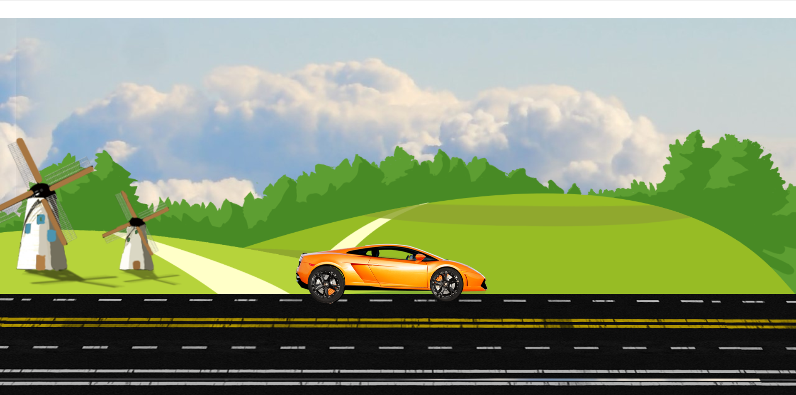

# 🚗 CAR Animation Project

A fun and smooth **2D Car Animation** built using pure **HTML, CSS**, and a pinch of **JavaScript**. Watch the car roll down a scenic animated track with rotating wheels and a moving background!

---

## 🌟 Features

- 🚙 Animated car with realistic **wheel rotation**
- 🛣️ Infinite track scrolling effect
- 🌳 Dynamic trees & sky for immersive background
- 🎵 Background audio integration
- 💻 Responsive design (for larger screens)

---

## ⚙️ Tech Stack

- **HTML5** – Structure
- **CSS3** – Animation & Design
- **JavaScript** – Audio playback

---

## 📸 Screenshots

### 🎬 Live Scene  
*(Add a screenshot named `car_animation_preview.png` in the `screenshots/` folder)*  


---

## 🚀 How to Run

1. Clone or download this repository.
2. Open `index.html` in your browser.
3. Enjoy the animation!

```bash
# Clone this repository
git clone https://github.com/Ranjit-Saha/CAR-Animation.git

# Open the folder
cd CAR-Animation

# Run it by opening index.html in your browser
